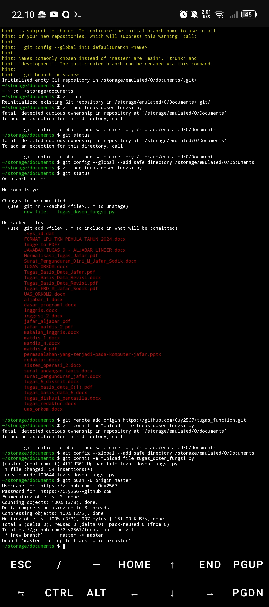
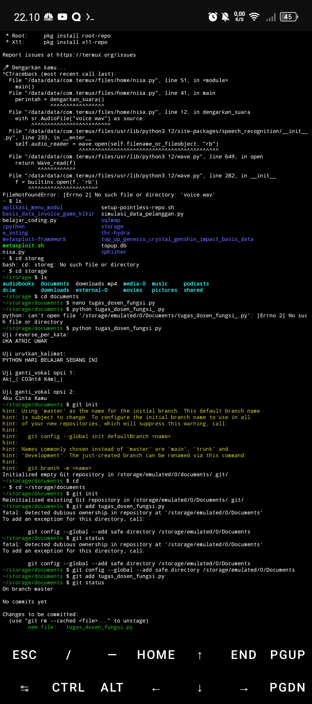

# Tugas Function & Manipulasi String – Python

## Deskripsi
Program Python ini menyelesaikan manipulasi string dengan 3 fungsi:
1. `reverse_per_kata(kalimat)`
2. `urutkan_kalimat(kalimat, urutan)`
3. `ganti_vokal(kalimat, opsi)`

Tanpa import, modul eksternal, atau menu interaktif.

## File
- `tugas_dosen_fungsi.py`
- `screenshot_1.png`, `screenshot_2.png` (uji coba)

## Author
M. Jafar Sodik (Guy2567)

## Hasil Uji Program
Berikut ini screenshot hasil uji program:

